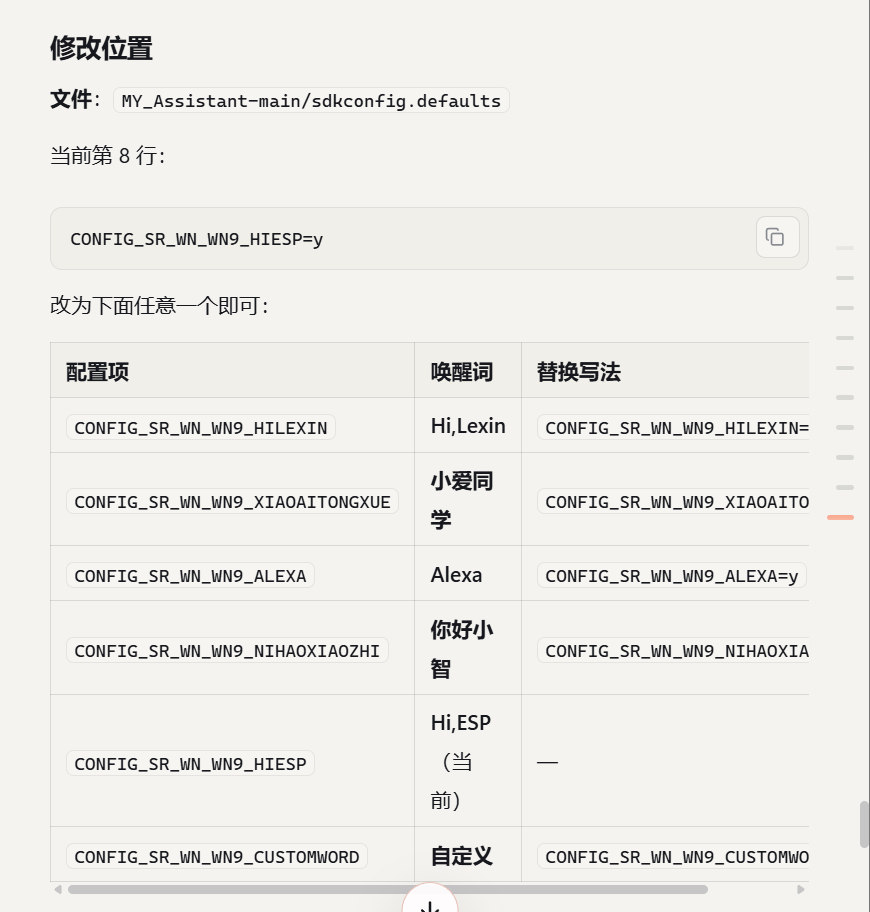
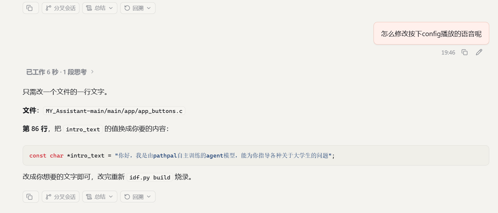

# ESP32 AI BOX1 10 分钟烧录清单

目标：板子到货后，**10 分钟内完成烧录并看到启动日志**。

这份只写最短路径。遇到问题再看详细文档：

```text
ESP32_AI_BOX1_Flash_Guide.md
```

## 0. 到板前确认

你现在 PC 上已经有编译好的文件，正常不需要重新编译。

项目目录：

```powershell
D:\BaiduNetdiskDownload\ESP32_AI_BOX1\MY_Assistant-main
```

## 1. 插板子

1. 用 **USB 数据线** 连接 ESP32 AI BOX1 和电脑。
2. 打开 **设备管理器**。
3. 找到 **端口 COM 和 LPT**。
4. 记住新出现的串口号，例如：

```text
COM5
```

后面所有命令里的 `COM5` 都要换成你的实际串口号。

## 2. 打开 ESP-IDF 终端

打开：

```text
ESP-IDF 5.2.1 PowerShell
```

进入项目：

```powershell
cd D:\BaiduNetdiskDownload\ESP32_AI_BOX1\MY_Assistant-main
```

## 3. 直接烧录

假设串口是 `COM5`，直接执行：

```powershell
python -m esptool --chip esp32s3 -p COM5 -b 460800 --before default_reset --after hard_reset write_flash --flash_mode dio --flash_size 16MB --flash_freq 80m `
0x0 build\bootloader\bootloader.bin `
0x8000 build\partition_table\partition-table.bin `
0xd000 build\ota_data_initial.bin `
0x10000 build\chatgpt_demo.bin `
0x700000 factory_nvs\build\factory_nvs.bin `
0x900000 build\storage.bin `
0xb00000 build\srmodels\srmodels.bin
```

```
deepseek做的指令
python -m esptool --chip esp32s3 -p COM5 -b 460800 --before default_reset --after hard_reset write_flash --flash_mode dio --flash_size 16MB --flash_freq 80m `
0x0 build\bootloader\bootloader.bin `
0x8000 build\partition_table\partition-table.bin `
0xd000 build\ota_data_initial.bin `
0xf000 build\phy_init\phy_init.bin `
0x10000 build\chatgpt_demo.bin `
0x700000 factory_nvs\build\factory_nvs.bin `
0x900000 build\storage.bin `
0xb00000 build\srmodels\srmodels.bin
```

如果你的串口是 `COM8`，只改这里：

```powershell
-p COM5
```

改成：

```powershell
-p COM8
```

## 4. 烧录成功标志

看到类似这些就算烧录成功：

```text
Chip is ESP32-S3
Writing at 0x00010000
Writing at 0x00700000
Writing at 0x00900000
Writing at 0x00b00000
Hash of data verified.
Hard resetting via RTS pin...
```

最关键是：

```text
Hash of data verified.
```

## 5. 打开启动日志

烧录完成后执行：

```powershell
idf.py -p COM5 monitor
```

如果你的串口不是 `COM5`，同样换成你的串口。

退出日志：

```text
Ctrl + ]
```

## 6. 如果 10 分钟内遇到连接失败

如果出现：

```text
Failed to connect to ESP32
```

按顺序做：

1. 确认 `COM5` 是否写成了你的真实串口。
2. 关闭串口助手、Arduino、其他 monitor。
3. 按一下板子的 `RESET`，再烧一次。
4. 还是不行就手动进下载模式：
   - 按住 `BOOT`
   - 短按 `RESET`
   - 松开 `RESET`
   - 继续按住 `BOOT` 1 秒
   - 松开 `BOOT`
   - 再执行烧录命令
5. 还不行，把烧录命令里的：

```powershell
-b 460800
```

改成：

```powershell
-b 115200
```

## 7. 不要执行这个

不要直接执行：

```powershell
idf.py flash
```

原因一句话：

> 当前项目默认 flash 提示可能把主程序放到错误区域。本文命令已经手动指定了正确地址。

主程序必须是这一行：

```powershell
0x10000 build\chatgpt_demo.bin
```

不是：

```powershell
0x700000 build\chatgpt_demo.bin
```

## 8. 你真正要记住的三件事

1. 先找串口号。
2. 复制第 3 节命令，只改 `COM5`。
3. 烧完执行 `idf.py -p COM5 monitor` 看日志。

## 9. 换唤醒词



## 10. 换按键播放
