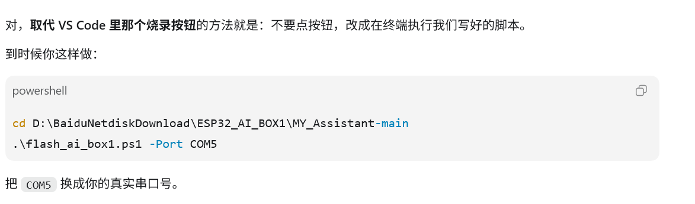

# ESP32 AI BOX1 到板后烧录详细操作指南

本文档用于你买的 **正点原子 ESP32 AI BOX1** 到货后，把当前已经编译好的 `MY_Assistant-main` 固件烧录进去，并验证语音助手是否能启动。

当前 PC 上已经编译好的固件包括：

- 主固件：`build\chatgpt_demo.bin`
- 出厂配置辅助固件：`factory_nvs\build\factory_nvs.bin`
- 启动器、分区表、OTA 数据、资源分区、语音模型分区

你到板后不需要重新编译，先按本文烧录即可。

## 0. 你需要准备什么

硬件：

- 正点原子 ESP32 AI BOX1 板子
- 一根支持数据传输的 USB 线
- Windows 电脑

软件：

- ESP-IDF 5.2.1 PowerShell 终端
- 当前项目目录：

```powershell
D:\BaiduNetdiskDownload\ESP32_AI_BOX1\MY_Assistant-main
```

需要注意：

- 不要用只支持充电的 USB 线。
- 烧录时要知道板子的串口号，例如 `COM5`。
- 本项目不推荐直接执行 `idf.py flash`，后面会解释原因。

## 1. 先确认这些固件文件都存在

打开 ESP-IDF 5.2.1 PowerShell，执行：

```powershell
cd D:\BaiduNetdiskDownload\ESP32_AI_BOX1\MY_Assistant-main
```

然后检查这些文件：

```powershell
dir build\bootloader\bootloader.bin
dir build\partition_table\partition-table.bin
dir build\ota_data_initial.bin
dir build\chatgpt_demo.bin
dir factory_nvs\build\factory_nvs.bin
dir build\storage.bin
dir build\srmodels\srmodels.bin
```

如果都能看到文件，说明 PC 端固件准备好了。

这些文件分别的作用：

| 文件 | 烧录地址 | 作用 |
| --- | --- | --- |
| `bootloader.bin` | `0x0` | 芯片上电后最先执行的启动加载器。 |
| `partition-table.bin` | `0x8000` | 分区表，告诉芯片 Flash 里每一块区域分别放什么。 |
| `ota_data_initial.bin` | `0xd000` | OTA 启动选择数据，初始化启动状态。 |
| `chatgpt_demo.bin` | `0x10000` | 主程序，也就是语音助手主体。 |
| `factory_nvs.bin` | `0x700000` | 出厂配置/辅助固件区域。 |
| `storage.bin` | `0x900000` | 文件系统或资源分区。 |
| `srmodels.bin` | `0xb00000` | 语音识别/唤醒相关模型。 |

## 2. 板子到了以后，第一步：连接电脑

1. 用 USB 数据线把 ESP32 AI BOX1 连接到电脑。
2. 打开 Windows 的 **设备管理器**。
3. 找到 **端口 COM 和 LPT**。
4. 观察有没有新增串口，例如：

```text
USB Serial Device (COM5)
Silicon Labs CP210x USB to UART Bridge (COM5)
USB JTAG/serial debug unit (COM5)
```

你看到的 `COM5`、`COM6`、`COM8` 之类，就是后面烧录命令里的串口号。

如果没有出现串口：

- 换一根 USB 线。
- 换电脑 USB 口。
- 不要先接扩展坞，优先直接插电脑。
- 按一下板子的 `RESET`。
- 如果仍然不行，按住 `BOOT` 再插 USB，或者按住 `BOOT` 时短按 `RESET`。

## 3. 为什么要手动指定烧录地址

ESP32-S3 的 Flash 可以理解成一整条存储空间，不同地址放不同内容：

```text
0x000000  bootloader
0x008000  partition table
0x00d000  ota data
0x010000  主程序 chatgpt_demo.bin
0x700000  factory_nvs.bin
0x900000  storage.bin
0xb00000  srmodels.bin
```

所谓“换区域”，不是在某个软件界面里点选分区，而是在烧录命令里写：

```powershell
0x10000 build\chatgpt_demo.bin
```

这句话的意思就是：

> 把 `chatgpt_demo.bin` 烧录到 Flash 的 `0x10000` 位置。

本项目默认生成的烧录提示里可能会出现：

```text
0x700000 chatgpt_demo.bin
```

这对当前项目不合适，因为：

- `chatgpt_demo.bin` 是主程序，应该从主 app 分区启动。
- 主程序体积约 3.5MB。
- `0x700000` 附近是 factory/uf2 相关区域，不适合作为主程序启动位置。
- 如果把主程序烧到错误区域，可能出现烧录失败、启动失败、循环重启、找不到 app 等问题。

所以本文统一使用手动 `esptool` 命令，把主程序明确放到 `0x10000`。

## 4. 正式烧录前确认串口号

假设你在设备管理器里看到的是 `COM5`，后面命令就用 `COM5`。

如果你看到的是 `COM8`，就把命令里的 `COM5` 改成 `COM8`。

示例：

```powershell
-p COM5
```

意思是使用 `COM5` 这个串口烧录。

## 5. 推荐的完整烧录命令

先进入项目目录：

```powershell
cd D:\BaiduNetdiskDownload\ESP32_AI_BOX1\MY_Assistant-main
```

如果你的串口是 `COM5`，执行下面整条命令：

```powershell
python -m esptool --chip esp32s3 -p COM5 -b 460800 --before default_reset --after hard_reset write_flash --flash_mode dio --flash_size 16MB --flash_freq 80m `
0x0 build\bootloader\bootloader.bin `
0x8000 build\partition_table\partition-table.bin `
0xd000 build\ota_data_initial.bin `
0x10000 build\chatgpt_demo.bin `
0x700000 factory_nvs\build\factory_nvs.bin `
0x900000 build\storage.bin `
0xb00000 build\srmodels\srmodels.bin
```

如果你的串口不是 `COM5`，只改这一处：

```powershell
-p COM5
```

例如串口是 `COM8`：

```powershell
python -m esptool --chip esp32s3 -p COM8 -b 460800 --before default_reset --after hard_reset write_flash --flash_mode dio --flash_size 16MB --flash_freq 80m `
0x0 build\bootloader\bootloader.bin `
0x8000 build\partition_table\partition-table.bin `
0xd000 build\ota_data_initial.bin `
0x10000 build\chatgpt_demo.bin `
0x700000 factory_nvs\build\factory_nvs.bin `
0x900000 build\storage.bin `
0xb00000 build\srmodels\srmodels.bin
```

## 6. 烧录时屏幕上应该看到什么

正常情况下会看到类似信息：

```text
Connecting....
Chip is ESP32-S3
Writing at 0x000000...
Writing at 0x008000...
Writing at 0x00d000...
Writing at 0x010000...
Writing at 0x700000...
Writing at 0x900000...
Writing at 0xb00000...
Hash of data verified.
Hard resetting via RTS pin...
```

看到 `Hash of data verified` 说明写入的数据校验通过。

看到 `Hard resetting via RTS pin` 说明烧录完成后工具尝试自动复位板子。

## 7. 如果烧录连接失败怎么办

如果出现：

```text
A fatal error occurred: Failed to connect to ESP32
```

按这个顺序处理：

1. 确认串口号没有写错。
2. 关闭所有可能占用串口的软件，例如串口助手、Arduino 串口监视器、另一个 `idf.py monitor`。
3. 按一下板子的 `RESET`，重新执行烧录命令。
4. 进入下载模式后再烧录：
   - 按住 `BOOT`。
   - 短按一下 `RESET`。
   - 松开 `RESET`。
   - 继续按住 `BOOT` 1 秒左右。
   - 松开 `BOOT`。
   - 重新执行烧录命令。
5. 如果还失败，把烧录速度降低：

```powershell
-b 460800
```

改成：

```powershell
-b 115200
```

完整低速命令示例：

```powershell
python -m esptool --chip esp32s3 -p COM5 -b 115200 --before default_reset --after hard_reset write_flash --flash_mode dio --flash_size 16MB --flash_freq 80m `
0x0 build\bootloader\bootloader.bin `
0x8000 build\partition_table\partition-table.bin `
0xd000 build\ota_data_initial.bin `
0x10000 build\chatgpt_demo.bin `
0x700000 factory_nvs\build\factory_nvs.bin `
0x900000 build\storage.bin `
0xb00000 build\srmodels\srmodels.bin
```

## 8. 烧录完成后打开串口监视器

烧录完成后，继续在项目目录执行：

```powershell
idf.py -p COM5 monitor
```

如果你的串口是 `COM8`，就用：

```powershell
idf.py -p COM8 monitor
```

退出串口监视器：

```text
Ctrl + ]
```

## 9. 启动日志应该关注什么

进入 monitor 后，重点看这些信息：

```text
ESP-ROM
boot:
partition table
I (...) app_start
I (...) wifi
I (...) audio
I (...) sr
I (...) lvgl
```

你不需要每一行都懂，重点是看有没有明显的：

```text
E (...)
abort
Guru Meditation
LoadProhibited
not found
failed
reboot
```

如果一直重启，通常说明：

- app 地址烧错了。
- 分区表没烧。
- 某个必要分区没烧，例如 `srmodels.bin` 或 `storage.bin`。
- 配置缺失，程序进入 factory reset 或配置流程。

## 10. 首次启动后怎么验证功能

建议按这个顺序验证，不要一上来就测完整语音链路。

### 10.1 验证屏幕和 UI

看屏幕是否点亮，UI 是否出现。

如果黑屏：

- 看串口日志是否还在正常运行。
- 如果日志正常但屏幕黑，可能是屏幕/BSP/背光问题。
- 如果日志不断重启，优先处理启动问题。

### 10.2 验证 Wi-Fi 和配置

看 UI 是否要求配置 Wi-Fi 或 API Key。

项目读取的 NVS 字段包括：

- `ssid`
- `password`
- `ChatGPT_key`

如果日志里出现类似：

```text
No SSID found
No Password found
No OpenAI key found
```

说明板子还没有配置这些参数，程序可能会进入 factory 配置流程。

### 10.3 验证厂家 agent

先确认 PC 端 agent API 已经能通。

也可以使用已经生成的 PC 语音模拟器测试：

```powershell
cd D:\BaiduNetdiskDownload\ESP32_AI_BOX1\MY_Assistant-main
$env:MFG_AGENT_API_KEY="你的厂家agent API_KEY"
python .\tools\pc_voice_agent_web.py
```

浏览器打开：

```text
http://127.0.0.1:8765/
```

PC 端语音互动能通，说明厂家 agent 的文字请求链路基本没问题。

### 10.4 验证板子的完整语音链路

完整链路是：

```text
你说话
-> 板子麦克风录音
-> STT 语音转文字
-> 文字发给厂家 agent
-> agent 返回文字
-> TTS 合成音频
-> 扬声器播放
```

测试时按顺序观察：

1. 说话后串口有没有录音或识别日志。
2. STT 是否输出识别到的文字。
3. agent 是否返回文本。
4. TTS 是否请求成功。
5. 扬声器是否播放。

如果其中某一步失败，就只查那一步，不要把所有问题混在一起。

## 11. 不同失败现象对应的原因

| 现象 | 更可能的原因 | 优先检查 |
| --- | --- | --- |
| 烧录时连不上 | 串口错、线不对、没进下载模式 | COM 号、USB 线、BOOT/RESET |
| 烧录成功但无日志 | 串口选错、monitor 波特率/端口不对 | `idf.py -p COMx monitor` |
| 不断重启 | app 地址错、分区缺失、运行时崩溃 | 是否按本文地址完整烧录 |
| UI 不显示 | 屏幕/BSP/背光/初始化问题 | 串口日志是否正常 |
| Wi-Fi 连接不上 | SSID/密码/NVS 配置问题 | NVS 配置、路由器 2.4G |
| 识别不到语音 | 麦克风/I2S/STT 配置问题 | 录音日志、STT 返回 |
| agent 无回复 | API Key、URL、模型名、网络问题 | PC 端 API 测试、串口 HTTP 错误 |
| 有文字无声音 | TTS 或音频播放问题 | TTS 返回、音频解码、功放/Codec |

## 12. 为什么 `factory_nvs.bin` 也要烧

`factory_nvs` 是这个项目的出厂配置相关辅助固件/区域。

烧它的原因：

- 项目启动时会读取 NVS 配置。
- 如果没有配置，可能会切到 factory 配置流程。
- `factory_nvs.bin` 对应项目设计中的 factory/配置区域。
- 不烧它可能导致首次启动配置流程异常，或者恢复配置时找不到对应内容。

所以本文把它放到：

```powershell
0x700000 factory_nvs\build\factory_nvs.bin
```

注意：这里烧的是 `factory_nvs.bin`，不是主程序 `chatgpt_demo.bin`。

## 13. 什么时候需要重新编译

只是板子到了以后烧录当前版本：

```text
不需要重新编译
```

修改以下内容后才需要重新编译：

- 厂家 agent URL
- 模型名
- API 请求格式
- STT/TTS 接口
- Wi-Fi/NVS 默认配置
- 音频 I2S 参数
- Codec 或功放初始化
- UI 页面
- 分区表 `partitions.csv`

重新编译主项目：

```powershell
cd D:\BaiduNetdiskDownload\ESP32_AI_BOX1\MY_Assistant-main
idf.py build
```

重新编译 `factory_nvs`：

```powershell
cd D:\BaiduNetdiskDownload\ESP32_AI_BOX1\MY_Assistant-main\factory_nvs
idf.py build
```

## 14. 最短操作清单

到板当天，如果你只想照着执行，可以按这个清单：

1. 插 USB 数据线。
2. 打开设备管理器，确认串口号，例如 `COM5`。
3. 打开 ESP-IDF 5.2.1 PowerShell。
4. 进入项目：

```powershell
cd D:\BaiduNetdiskDownload\ESP32_AI_BOX1\MY_Assistant-main
```

5. 执行烧录命令，把 `COM5` 换成你的实际串口：

```powershell
python -m esptool --chip esp32s3 -p COM5 -b 460800 --before default_reset --after hard_reset write_flash --flash_mode dio --flash_size 16MB --flash_freq 80m `
0x0 build\bootloader\bootloader.bin `
0x8000 build\partition_table\partition-table.bin `
0xd000 build\ota_data_initial.bin `
0x10000 build\chatgpt_demo.bin `
0x700000 factory_nvs\build\factory_nvs.bin `
0x900000 build\storage.bin `
0xb00000 build\srmodels\srmodels.bin
```

6. 烧录完成后打开日志：

```powershell
idf.py -p COM5 monitor
```

7. 看屏幕是否亮、日志是否正常。
8. 配置 Wi-Fi/API Key。
9. 测试语音输入、agent 回复、TTS 播放。

## 15. 记住这句话

你不需要手动在界面里“换区域”。

烧录区域由命令里的地址决定。

最关键的是这几行：

```powershell
0x10000 build\chatgpt_demo.bin
0x700000 factory_nvs\build\factory_nvs.bin
0x900000 build\storage.bin
0xb00000 build\srmodels\srmodels.bin
```

其中：

- `chatgpt_demo.bin` 是主程序，必须放 `0x10000`。
- `factory_nvs.bin` 放 `0x700000`。
- `storage.bin` 放 `0x900000`。
- `srmodels.bin` 放 `0xb00000`。

1. 

2. pc_voice_agent_web.py

-  运行方法：
   cd D:\BaiduNetdiskDownload\ESP32_AI_BOX1\MY_Assistant-main
   $env:MFG_AGENT_API_KEY="sk-xxxxxxxx"
   python .\tools\pc_voice_agent_web.py
- 看到提示后，用 Microsoft Edge 或 Chrome 打开：
  http://127.0.0.1:8765/
